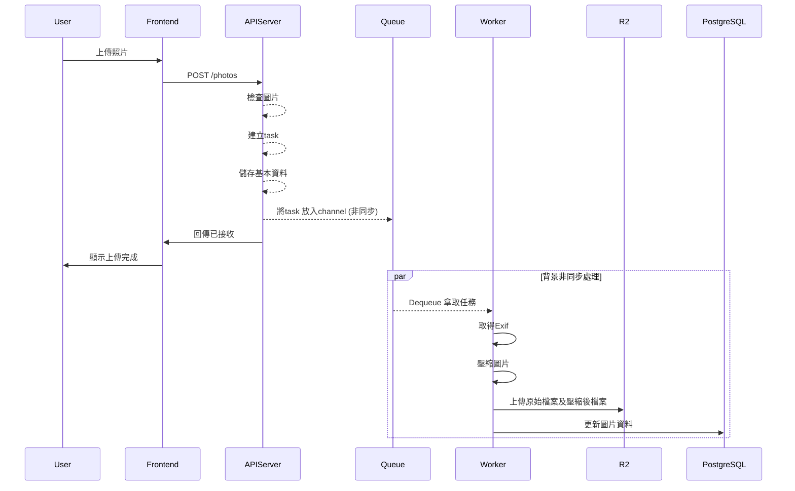
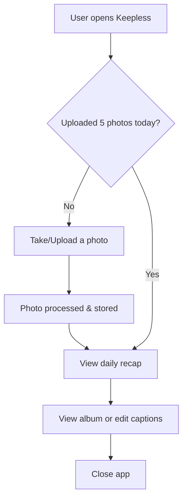
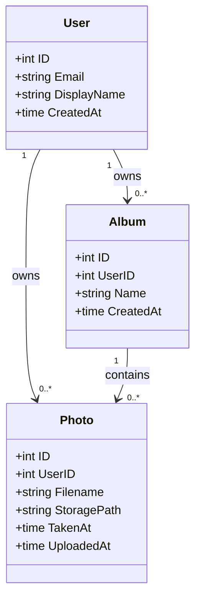
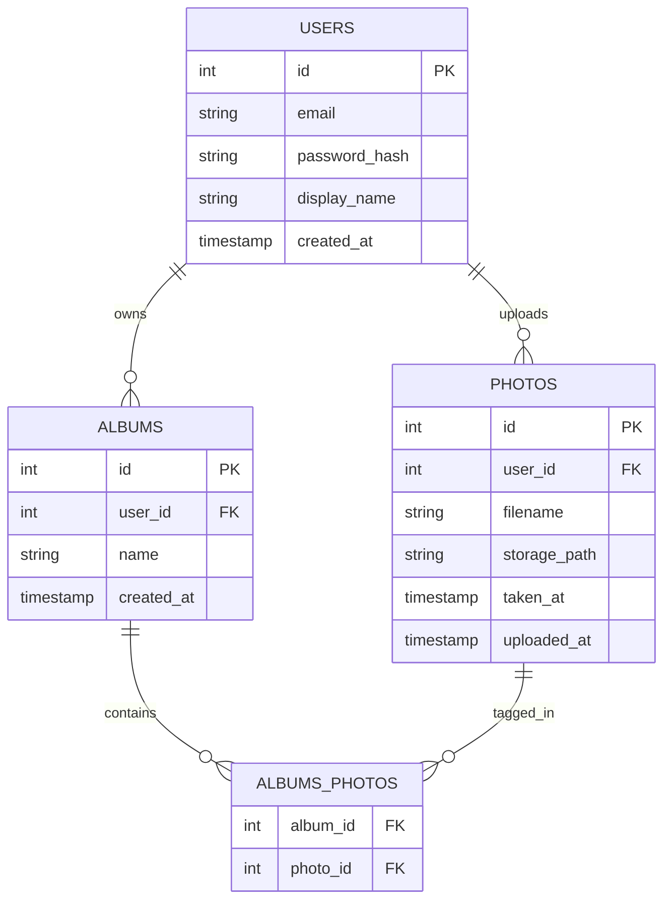
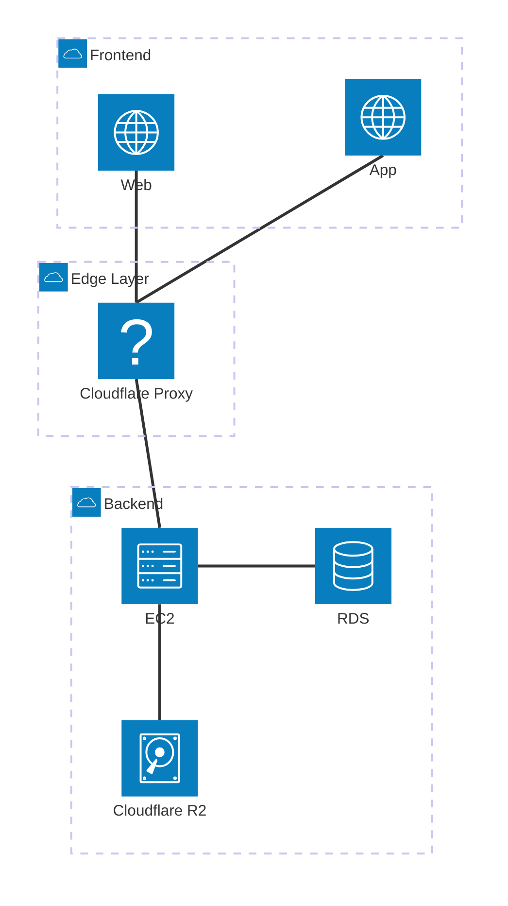

```mermaid

---
config:
  look: classic
  theme: Default
---
sequenceDiagram
    participant User
    participant Frontend
    participant APIServer
    participant Channel as Queue
    participant Worker
    participant R2
    participant PostgreSQL
    User->>Frontend: 上傳照片
    Frontend->>APIServer: POST /photos
    APIServer-->>APIServer: 檢查圖片
    APIServer-->>APIServer: 建立task
    APIServer-->>APIServer: 儲存基本資料
    APIServer-->>Channel: 將task 放入channel (非同步)
    APIServer->>Frontend: 回傳已接收
    Frontend->>User: 顯示上傳完成
    par 背景非同步處理
    Channel-->>Worker: Dequeue 拿取任務
    Worker->>Worker: 取得Exif
    Worker->>Worker: 壓縮圖片
    Worker->>R2: 上傳原始檔案及壓縮後檔案
    Worker->>PostgreSQL: 更新圖片資料
    end
```

```mermaid
flowchart TD
    A[User opens Keepless] --> B{Uploaded 5 photos today?}
    B -- No --> C[Take/Upload a photo]
    C --> D[Photo processed & stored]
    D --> E[View daily recap]
    B -- Yes --> E
    E --> F[View album or edit captions]
    F --> G[Close app]
```

```mermaid
classDiagram
    class User {
        +int ID
        +string Email
        +string DisplayName
        +time CreatedAt
    }

    class Photo {
        +int ID
        +int UserID
        +string Filename
        +string StoragePath
        +time TakenAt
        +time UploadedAt
    }

    class Album {
        +int ID
        +int UserID
        +string Name
        +time CreatedAt
    }

    User "1" --> "0..*" Photo : owns
    User "1" --> "0..*" Album : owns
    Album "1" --> "0..*" Photo : contains

```

```mermaid
erDiagram
    USERS {
        int id PK
        string email
        string password_hash
        string display_name
        timestamp created_at
    }
    PHOTOS {
        int id PK
        int user_id FK
        string filename
        string storage_path
        timestamp taken_at
        timestamp uploaded_at
    }
    ALBUMS {
        int id PK
        int user_id FK
        string name
        timestamp created_at
    }
    ALBUMS_PHOTOS {
        int album_id FK
        int photo_id FK
    }

    USERS ||--o{ PHOTOS : uploads
    USERS ||--o{ ALBUMS : owns
    ALBUMS ||--o{ ALBUMS_PHOTOS : contains
    PHOTOS ||--o{ ALBUMS_PHOTOS : tagged_in

```

```mermaid
architecture-beta

group edge(cloud)[Edge Layer]
    service cloudproxy(dns)[Cloudflare Proxy] in edge

group frontend(cloud)[Frontend]
    service app(internet)[App] in frontend
    service web(internet)[Web] in frontend

group backend(cloud)[Backend]
    service ec2(server)[EC2] in backend
    service rds(database)[RDS] in backend
    service r2(disk)[Cloudflare R2] in backend

app:B -- T:cloudproxy
web:B -- T:cloudproxy
cloudproxy:B -- T:ec2
ec2:R -- L:rds
ec2:B -- T:r2

```
